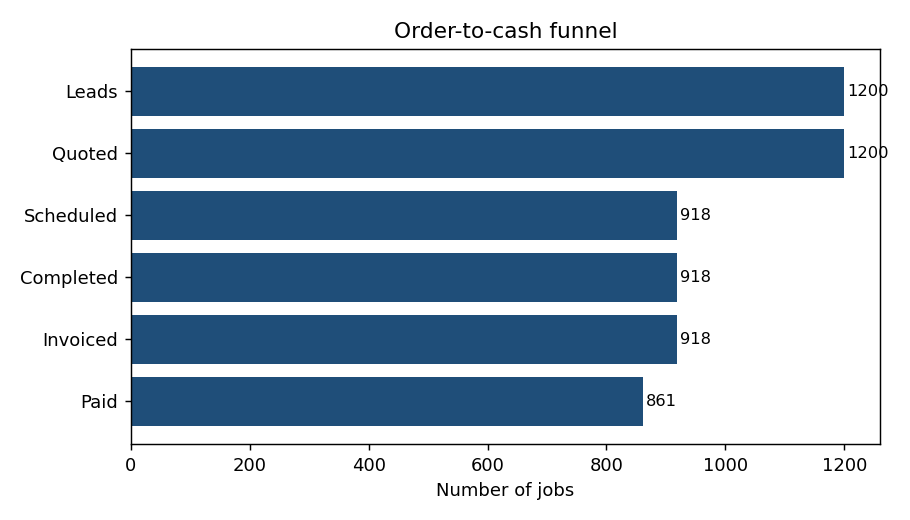
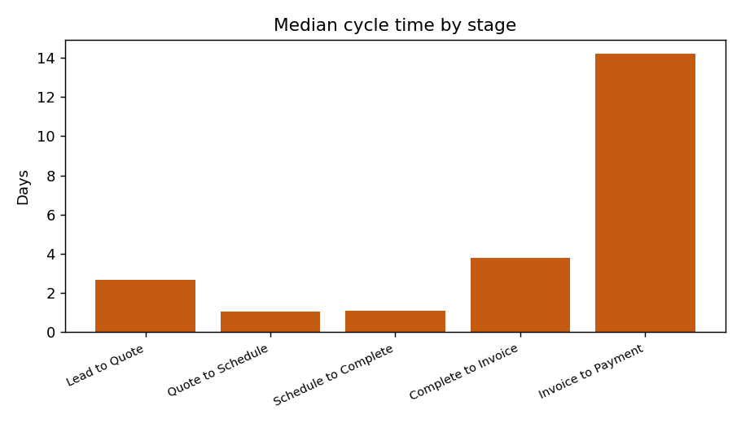

# ProcessLens — Business Process Analysis & Improvement Toolkit

A small analytics toolkit that reviews an **order-to-cash business process** end to
end, finds the bottleneck, quantifies rework, and models a process-improvement
scenario. Built as a learning project to practise the kind of process review and
operational-data analysis used in business/operations consulting.

> **Scenario:** *Brightway Facilities Services* (a fictional cleaning & facilities
> company). All data is **synthetic**, generated locally by `generate_data.py`.

## What it does
- Builds the process funnel: `lead → quoted → scheduled → completed → invoiced → paid`
- Measures **cycle time** for every stage (median / mean / 90th percentile)
- Identifies the **bottleneck** stage and the **conversion drop-off**
- Calculates the **rework rate** (jobs redone due to quality issues)
- Models a **"what if"** improvement scenario (cut the worst stage by 40%)

## Why it's interesting
Process reviews usually *feel* qualitative ("invoicing is slow"). This shows how to
make the case with data — turning a vague complaint into a quantified bottleneck and
a sized improvement opportunity, which is the core of process-improvement work.

## Tech
Python · pandas · SQLite (SQL queries) · matplotlib

## Run it
```bash
pip install -r requirements.txt
python generate_data.py    # creates data/jobs.csv and data/processlens.db
python analyze.py          # writes charts + outputs/summary.md
```

## Sample output
- `outputs/funnel.png` — jobs surviving each stage
- `outputs/cycle_times.png` — median days per stage
- `outputs/summary.md` — written findings with the improvement scenario




## What I'd do next
- Add a cost model (labour + rework $) to convert days saved into dollars
- Segment bottlenecks by service type and region
- Add a simple Streamlit dashboard for interactive filtering

---
*Synthetic-data portfolio project. Not affiliated with any real company.*
